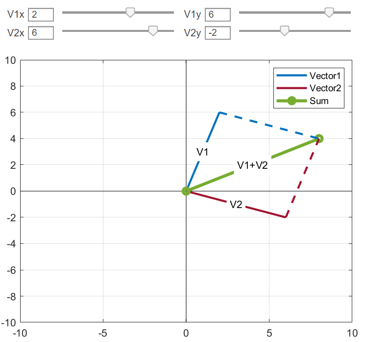

I will be updating the Mechanics related interactive scripts for the students to have a better visualization of the subject.
A simple starting point could be an interactive 2D vector Addition script. For some reasonable range, the code shows how the vectors add.

